# Установка
Клонирование репозитория
```
git clone https://github.com/ValMor561/ExtenderBH.git
```
Установка зависимостей
```
cd ExtenderBH
pip install -r requirements.txt
```
# Использование
```
python extender_bh.py -h
```
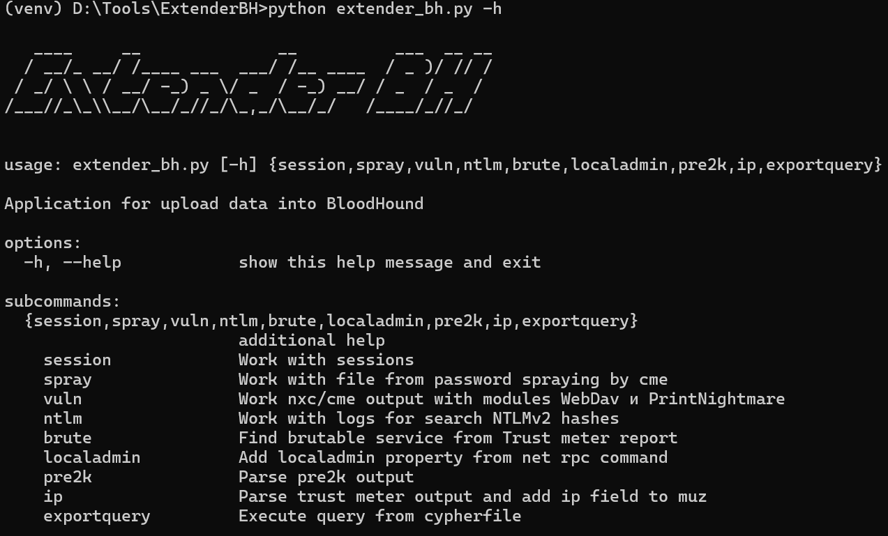
На текущий момент инструмент состоит из 9 основных модулей, а так же вспомогательного модуля для работы с базой данных neo4j, который используется во всех основных модулях.
## Вспомогательный модуль neo4j
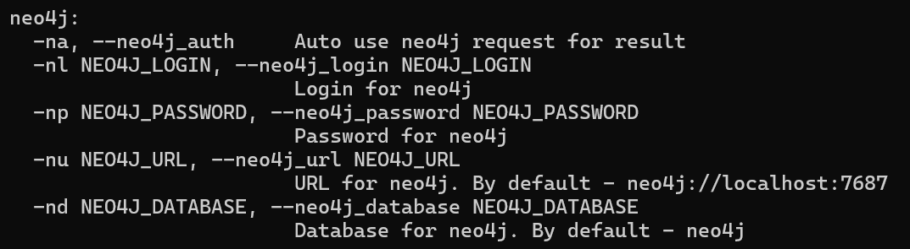
Включается флагом `-na`, и содержит два обязательных параметра - имя пользователя базы neo4j (`-nl`) и пароль (`-np`)
Ссылка до базы данных neo4j, а также имя базы данных устанавливается по умолчанию, однако если есть необходимость в изменении этих параметров, можно задать свои значения.
## Модуль session
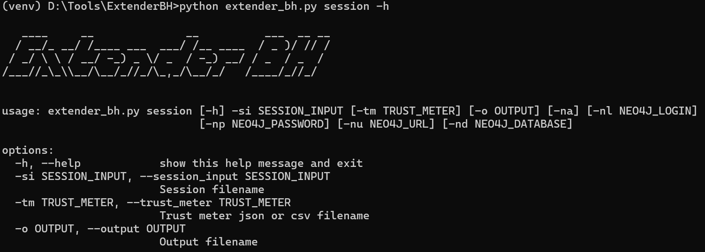
Обрабатывает результат работы скрипта [Get-LoggedOn.py](https://gist.icoder.workers.dev/GeisericII/6849bc86620c7a764d88502df5187bd0), вывод которого, видоизменен для упрощения обработки. Измененный скрипт находится в папке `additional_scripts`. 
Помимо этого использует результат работы [TrustMeter](https://zeronetworks.com/platform/trustmeter), для перевода IP адресов в NetBIOS имена. Походят как результаты в формате `json`, так и в `csv`.
Пример команды для запуска модуля:
```
python .\extender_bh.py session -si .\sessions.txt -tm '.\test.local Report.json' -na -nl neo4j -np 1234
```
## Модуль spray
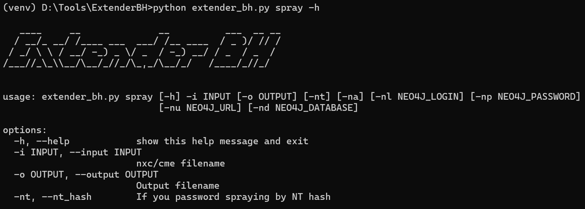
Обрабатывает результат атаки Password Spraying, с помощью [NetExec](https://github.com/Pennyw0rth/NetExec). Помечает положительные результаты как захваченные узлы, а так же устанавливает атрибут `ClearTextPassword`. 
Если найденная учетная запись обладает правами администратора на системе, добавит ребро `AdminTo`. 
Пример команды для запуска `nxc`:
```
nxc smb <dc-ip> -u user.txt -p <pass> --continue-on-succes | tee spray.txt
```
Пример команды для запуска модуля:
```
python extender_bh.py spray -i spray.txt -na -nl neo4j -np 1234
```
## Модуль vuln
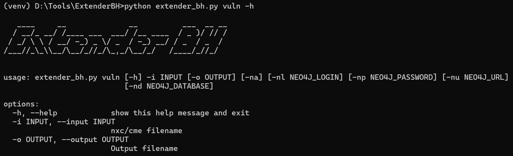
Обрабатывает результат сканирования уязвимостей с помощью NetEXEC, с модулями `WebDav` и `printnightmare`. Уязвимые хосты помечаются как захваченные, так же добавляется атрибут `Vuln` указывающий на тип уязвимости.
Пример команды для поиска WebDav:
```
nxc smb scope.txt -u user -p pass -M webdav | grep -ai WebClient | tee webdav.txt
```
Пример команды для поиска PrintNigtmare:
```
nxc smb scope.txt -u user -p pass -M printnightmare | grep -ai ly4k | grep -avi ')' | tee pnm.txt
```
Пример команды для запуска модуля:
```
python extender_bh.py vuln -i webdav.txt -na -nl neo4j -np 1234
```
## Модуль ntlm
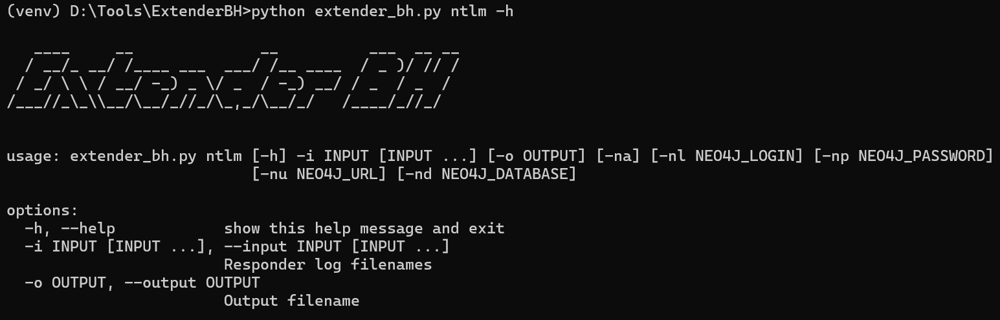
Обрабатывает файл логов `Responder`, с добавлением полей `NetNTLMv1` или `NetNTLMv2` и количества раз встречающихся в логах хэшей пользователей.
Пример команды для запуска модуля:
```
python extender_bh ntlm -i responder.log -na -nl neo4j -np 1234
```
## Модуль ports
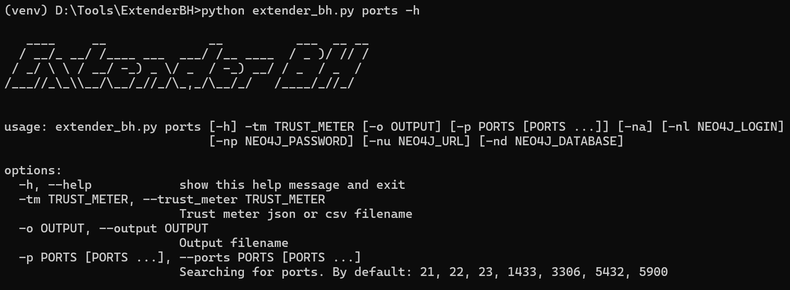
Обрабатывает результат работы Trust Meter и добавляет открытые порты в атрибут `ports`. Однако для сокращения времени работы, по умолчанию проверяются не все порты а только наиболее распространённые.
Пример команды для запуска модуля:
```
python extender_bh ports -tm '.\test.local Report.json' -na -nl neo4j -np 1234
```
## Модуль localadmin
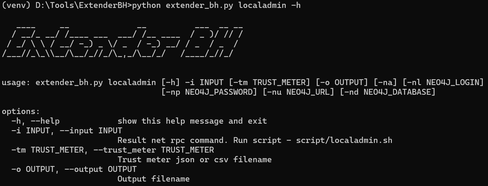
Обрабатывает результат работы команды `net rpc group member`, с целью добавления новых ребер `AdminTo` и получения списка локальных администраторов. 
Процесс запуска команды на несколько систем, автоматизирован в bash скрипте `localadmin.sh` в папке `additional_scripts`
Скрипт имеет следующие аргументы:
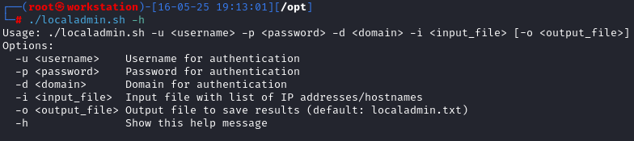
Пример команды для запуска скрипта:
```
./localadmin.sh -d test.local -u user -p pass -i scope.txt
```
Пример команды для запуска модуля:
```
python extender_bh -i localadmin.txt -tm '.\test.local Report.json' -na -nl neo4j -np 1234
```
## Модуль pre2k
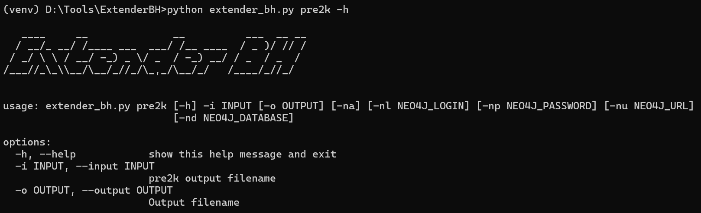
Обрабатывает результат работы инструмента [pre2k](https://github.com/garrettfoster13/pre2k), помечая найденные учетные записи как `Owned` и устанавливая значения поля `ClearTextPassword`
Пример команды для запуска модуля:
```
python extender_bh pre2k -i pre2k.txt -na -nl neo4j -np 1234
```
## Модуль ip
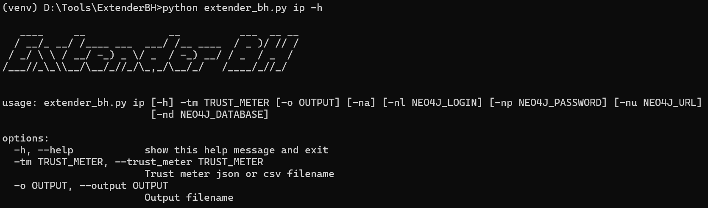
Обрабатывает результат работы `Trust Meter`, добавляя атрибут IP, для всех машинных учетных записей. Таким образов, применив этот модуль вначале, отпадает необходимость в использовании флага `-tm`, для всех модулей.
Пример команды для запуска модуля:
```
python extender_bh -tm '.\test.local Report.json' -na -nl neo4j -np 1234
```
## Модуль exportquery
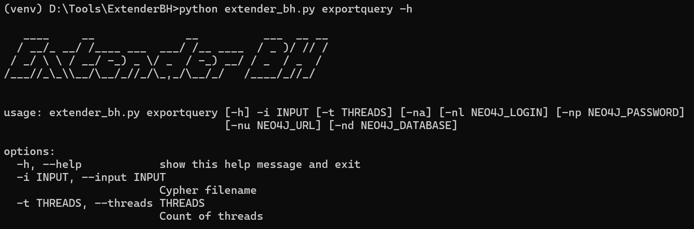
Позволяет экспортировать в `.cypher`, полученные в результате работы модулей. Необходимо если не использовался флаг `-na`, либо произошла какая-то ошибка при запросах в базу neo4j.
Параметр threads позволяет управлять количеством потоков.
Пример команды для запуска модуля:
```
python extender_bh.py exportquery -i vuln_extended_bh.cypher -na -nl neo4j -np 1234
```
# Customquery
Помимо прочего с учетом дополнительных полей были разработаны ряд пользовательских запросов. Чтобы добавить их в свой BloodHound, необходимо изменить существующий файл `customqueries.json`
## Расположение на Linux
```sh
locate customqueries.json
```
Если установка происходила от имени пользователя root
```
/root/.config/bloodhound/customqueries.json
```
## Расположение на Windows
```
C:\Users\<User>\AppData\Roaming\bloodhound\customqueries.json
```