Расширение сбора и добавления сущностей и связей для BloodHound.

# Добавление customqueries
## Linux
```sh
locate customquery.json
```
У меня
```
/root/.config/bloodhound/customqueries.json
```
## Windows
```
C:\Users\<User>\AppData\Roaming\bloodhound
```
# Sessions
Добавляет связи HasSession основываясь на файле сессий и json файле машинных учетных записей TrustMetter
## Параметры
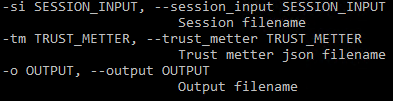
### session_input(si)
Имя файла в котором хранятся сессии
Пример файла:
```
[*] 10.13.122.108: [cluster03@test-tv]
[*] 172.30.88.95: [dalet_svc@adalet] [imisyuchenko@test-tv]
[*] 10.13.76.56: [achugunov@test-tv]
[*] 10.5.65.14: [svc_sql2012_sccm@mdc] [administrator@mdc] [admaprisyazhnyuk@test-tv]
[*] 10.5.115.13: [admdkotov@test-tv] [admin17@test-tv]
[*] 172.30.80.147: [skarnuyshkin@test-tv]
[*] 172.30.78.17: [dalet_svc@adalet] [dzadokhin@test-tv]
[*] 10.13.68.45: [npetrash@test-tv]
[*] 10.13.92.145: [evasko@test-tv]
...
```
### trust_metter(tm)
Имя `json` файла сгенерированного Trust Metter
Пример файла
```json
{
    "accessible_assets_count": 970,
    "accessible_client_assets_count": 783,
    "accessible_cloud_assets_count": 0,
    "accessible_server_assets_count": 164,
    "accessible_unknown_assets_count": 23,
    "assets": {
        "1-121-22.test-tv.ru": {
            "closed_tcp_ports": "",
            "closed_udp_ports": "",
            "distinguishedName": "cn=1-121-22,ou=w7wokrstations,ou=rus,ou=ostankino site,ou=cce,dc=test-tv,dc=ru",
            "fqdn": "1-121-22.test-tv.ru",
            "ip_address": [
                "172.30.82.40"
            ],
            "name": "1-121-22",
            "os": "Windows 10 \u041a\u043e\u0440\u043f\u043e\u0440\u0430\u0442\u0438\u0432\u043d\u0430\u044f",
            "os_ver": "10.0 (15063)",
            "resolved": true,
            "source": "Active Directory",
            "source_type": "Active Directory",
            "targets": "",
            "tcp_ports": "135, 139, 445, 3389",
            "type": "Client",
            "udp_ports": "",
            "wave": "Directly"
        },
        "1-121-23.test-tv.ru": {
            "closed_tcp_ports": "",
            "closed_udp_ports": "",
            "distinguishedName": "cn=1-121-23,ou=w7wokrstations,ou=rus,ou=ostankino site,ou=cce,dc=test-tv,dc=ru",
            "fqdn": "1-121-23.test-tv.ru",
            "ip_address": [
                "172.30.30.143"
            ],
            "name": "1-121-23",
            "os": "Windows 10 \u041a\u043e\u0440\u043f\u043e\u0440\u0430\u0442\u0438\u0432\u043d\u0430\u044f",
            "os_ver": "10.0 (15063)",
            "resolved": true,
            "source": "Active Directory",
            "source_type": "Active Directory",
            "targets": "",
            "tcp_ports": "135, 139, 445, 3389",
            "type": "Client",
            "udp_ports": "137",
            "wave": "Directly"
        },
        ...
```
### output(o)
Имя файла в который записывается результат
По умолчанию `extended_session_bh_%d_%m_%H_%M.txt`
Пример:
```cypher
MATCH (n:User) WHERE n.name =~ "(?i)cluster03@test-tv.*" MATCH (m:Computer) WHERE m.name =~ "(?i)test3.test-tv.ru.*" MERGE (n)-[r:HasSession]->(m);
MATCH (n:User) WHERE n.name =~ "(?i)dalet_svc@adalet.*" MATCH (m:Computer) WHERE m.name =~ "(?i)8-44-4.test-tv.ru.*" MERGE (n)-[r:HasSession]->(m);
...
```
## Регулярные выражения
### Ip адрес
```regex
([0-9]{1,3}[\.]){3}[0-9]{1,3}
```
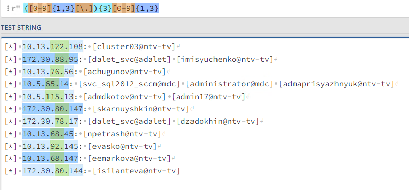
### Учетная запись
```regex
\[([^]^\*]*)\]
```
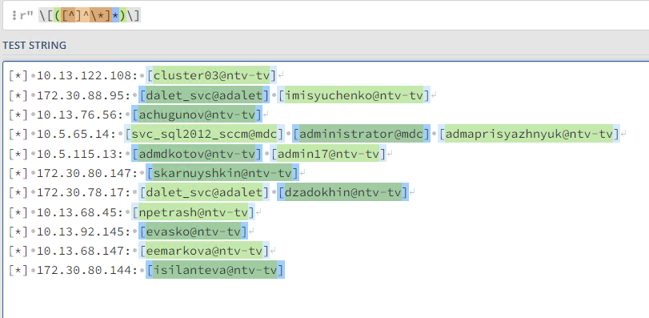
## Формирование запроса
Запрос
```cypher
MATCH (n:User) WHERE n.name =~ "(?i)<UZ>.*" (1)
MATCH (m:Computer) WHERE m.name =~ "(?i)<MUZ>.*" (2) 
MERGE (n)-[r:HasSession]->(m); (3) 
```
Здесь (1) и (2) запросы которые находят пользователей и компьютеров с соответствующими именами 
- =~ означает сравнение по регулярному выражению
- (?i)  не обращать внимание на регистр
- .* любые символы
(3) добавляет между ними ребро HasSession

## Customqueries

### Показать все узлы между которыми связь HasSession
```json
{
    "queries": [
        {
            "name": "Find all Hass Session relationships",
            "category" : "Extended_bh",
            "queryList": [
                {
                    "final": true,
                    "query": "MATCH p=()-[r:HasSession]->() RETURN p"
                }
            ]
        }
    ]
}
```
Запрос
```cypher
MATCH p=()-[r:HasSession]->() RETURN p
```
Пример ответа:


# Spray
Анализирует файл с результатами атаки password spraying с использованием cme или nxc

## Пример команды для формирования входного файла
```sh
crackmapexec smb <dc-ip> -u user.txt -p <pass> --continue-on-succes > spray.txt
```
или
```sh
crackmapexec smb <dc-ip> -u user.txt -H <NT-hash> --continue-on-succes --local-auth > spray.txt
```
Во 2 случае необходимо использовать флаг -nt
## Параметры
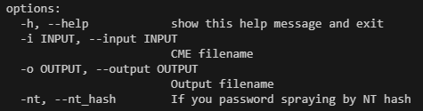
### input (i)
Имя файла с результатами из cme
Пример:
```cme
SMB         192.168.56.23   445    BRAAVOS          [-] essos.local\l.a.chaunina:12345 STATUS_LOGON_FAILURE 
SMB         192.168.56.12   445    MEEREEN          [+] essos.local\N.V.Animov:12345
SMB         192.168.56.23   445    BRAAVOS          [-] essos.local\v.i.klescheva:12345 STATUS_LOGON_FAILURE 
SMB         192.168.56.23   445    BRAAVOS          [-] essos.local\L.I.Ivakov:12345 STATUS_PASSWORD_MUST_CHANGE 
SMB         192.168.56.23   445    BRAAVOS          [-] essos.local\N.V.Mtushina:12345 STATUS_LOGON_FAILURE 
SMB         192.168.56.12   445    MEEREEN          [+] essos.local\N.V.Animov:12345 Pwn3d!
SMB         192.168.56.23   445    BRAAVOS          [-] essos.local\K.Y.Posobtsev:12345 STATUS_LOGON_FAILURE 
SMB         192.168.56.23   445    BRAAVOS          [-] essos.local\P.S.Bakitskaya:12345 STATUS_LOGON_FAILURE 
SMB         192.168.56.12   445    MEEREEN          [+] essos.local\N.V.Animov:12345 (Zh@hnut)
...
```
### output (o)
Имя файла в который записывается результат
По умолчанию `extended_spray_bh_%d_%m_%H_%M.txt`
Пример:
```cypher
MATCH (u:User) WHERE u.name =~ "(?i)N.V.Animov.*" SET u.ClearTextPassword = "12345" SET u.owned = True SET u.LocalAdmin = True;
MATCH (u:User) WHERE u.name =~ "(?i)L.I.Ivakov.*" SET u.PasswordMustBeChange = True SET u.OldPassword = "12345" SET u.owned = True;
MATCH (u:User) WHERE u.name =~ "(?i)vargant.*" SET u.ClearTextPassword = "12345" SET u.owned = True ;
MATCH (n:User) WHERE n.ClearTextPassword = "12345" MATCH (m:User) WHERE m.ClearTextPassword = "12345" FOREACH (_ IN CASE WHEN n <> m THEN [1] END | MERGE (n)-[r:SharePasswordWith]->(m));

...
```

### nt_hash (nt)
Если для атаки использовался NT-хэш и режим local-auth необходимо указать этот параметр, чтобы не добавлялось свойство ClearTextPassword

## Регулярные выражения
### Совпадение пароля
```regex
([^\s]*)\s*\[\+\]\s([^\\]*)\\([^:]*):([^\s]*)\s?(\(Zh@hnut\))?(Pwn3d!)?
```
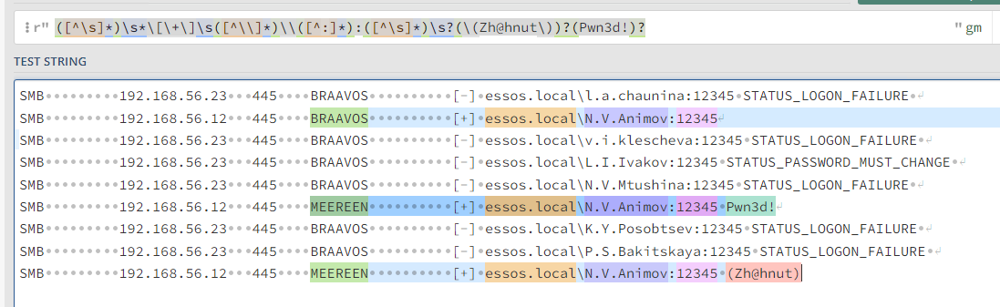
Здесь:
```python
target = match_plus[1]
domain = match_plus[2]
user = match_plus[3]
passw = match_plus[4]
zhahnut = match_plus[5]
pwned = match_plus[6]
```
### Необходимо сменить пароль
```regex
\[\-\]\s([^\\]*)\\([^:]*):([^\s]*)\sSTATUS_PASSWORD_MUST_CHANGE
```
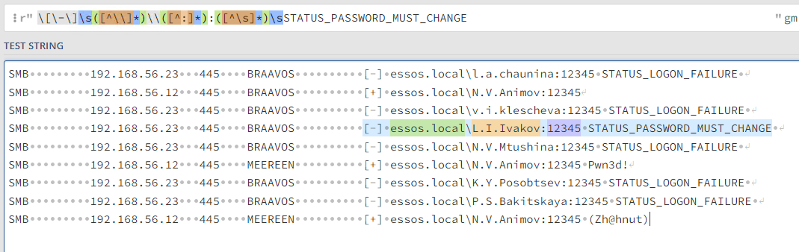
Здесь:
```python
domain = match_change[1]
user = match_change[2]
passw = match_change[3]
```
## Запросы
### Установка значения ClearTextPassword
```cypher
MATCH (u:User) WHERE u.name =~ "(?i){user}.*" SET u.ClearTextPassword = "{passw}" SET u.owned = True {localadmin};
```
Где localadmin устанавливается если есть Zh@hnut или Pwn3d! :
```cypher
"SET u.LocalAdmin = True"
```
Ищет пользователей с именем и устанавливает свойство ClearTextPassword. Так же делает пользователя захваченным.
### Добавление ребра SharePasswordWith
```cypher
MATCH (n:User) WHERE n.ClearTextPassword = "12345" 
MATCH (m:User) WHERE m.ClearTextPassword = "12345" 
FOREACH (_ IN CASE WHEN n <> m THEN [1] END | MERGE (n)-[r:SharePasswordWith]->(m));
```
Первые два запроса создают одинаковые списки пользователей с одинаковым паролем. Третий берет два списка сравнивает их, чтобы не было совпадения узлов, и создает связь _SharePasswordWith_.

### Добавление PasswordMustBeChange
```cypher
MATCH (u:User) WHERE u.name =~ "(?i){user}.*" SET u.PasswordMustBeChange = True SET u.OldPassword = "{passw}" SET u.owned = True;
```
Добавляет свойство означающее что пароль должен быть сменен, а так же в свойство OldPassword указывает значение пароля 

## Добавление ребра AdminTo
В случае если найденный пользователь является админом, добавляется ребро AdminTo до цели распыления
```cypher
MATCH (u:User) WHERE u.name =~ "(?i){user}.*" 
MATCH (c: Computer) WHERE c.name =~ "(?i){target}.*" 
MERGE (u)-[r: AdminTo]->(c);
```
## Customqueries
### Показать всех пользователей у которых мы знаем пароль
```json
{
	"name": "Find all user with ClearTextPassword",
    "category" : "Extended_bh",
    "queryList": [
		{
	        "final": true,
		    "query": "MATCH (u:User) WHERE u.ClearTextPassword=~'.*' return u;"
	     }
	 ]
}
```
Запрос:
```cypher
MATCH (u:User) WHERE u.ClearTextPassword=~'.*' return u
```
Пример ответа:
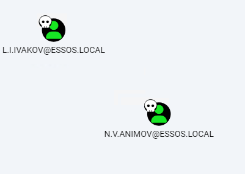
### Показать всех пользователей для которых можно сменить пароль
```json
{
	"name": "Find all user with PasswordMustBeChange",
	"category" : "Extended_bh",
	"queryList": [
		{
			"final": true,
			"query": "MATCH (u:User) WHERE u.PasswordMustBeChange = True return u;"
		}
	]
}
```
Запрос:
```cypher
MATCH (u:User) WHERE u.PasswordMustBeChange = True return u;
```
### Показать все узлы между которыми ребро SharedPasswordWith
```json
{
	"name": "Find all user with SharedPassword",
	"category" : "Extended_bh",
	"queryList": [
		{
			"final": true,
			"query": "MATCH p=(u1:User)-[r:SharePasswordWith]-(u2:User) return p"
		}
	]
}
```
Запрос
```cypher
MATCH p=(u1:User)-[r:SharePasswordWith]-(u2:User) return p
```
Пример ответа:
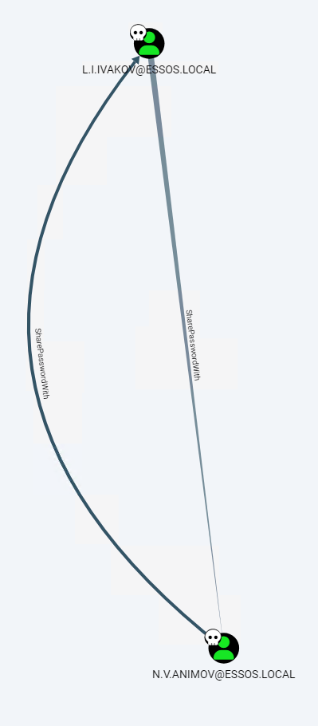

# NTLM
## Параметры
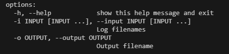
### input (i)
Имена файлов в которых хранятся перехваченные NTLMv2 хэши
Пример содержимого:
```ntlm
A.F.Vilina::ESSOS:f83621c7fe61e90c:E0EF893CF1B63D0349AA09DF02F14721:0101000000000000498E6BDB9FDEDA01085A8213F81A2A66000000000200080031004C005000310001001E00570049004E002D00510050003800370033004400510049003500370033000400140031004C00500031002E004C004F00430041004C0003003400570049004E002D00510050003800370033004400510049003500370033002E0031004C00500031002E004C004F00430041004C000500140031004C00500031002E004C004F00430041004C000800300030000000000000000000000000200000450DF2BD8CB3E6C5F1464B703A1855043B9BA2C83A921E2F628C84885C10E4940A0010000000000000000000000000000000000009001E0048005400540050002F00630061007300740065006C006200610063006B000000000000000000
A.F.Vilina::ESSOS:f83621c7fe61e90c:E0EF893CF1B63D0349AA09DF02F14721:0101000000000000498E6BDB9FDEDA01085A8213F81A2A66000000000200080031004C005000310001001E00570049004E002D00510050003800370033004400510049003500370033000400140031004C00500031002E004C004F00430041004C0003003400570049004E002D00510050003800370033004400510049003500370033002E0031004C00500031002E004C004F00430041004C000500140031004C00500031002E004C004F00430041004C000800300030000000000000000000000000200000450DF2BD8CB3E6C5F1464B703A1855043B9BA2C83A921E2F628C84885C10E4940A0010000000000000000000000000000000000009001E0048005400540050002F00630061007300740065006C006200610063006B000000000000000000
...
```
### output (o)
Имя файла в который записывается результат
По умолчанию `extended_ntlm_bh_%d_%m_%H_%M.txt`
Пример:
```cypher
MATCH (n) WHERE n.samaccountname =~ "(?i)A.F.Vilina" SET n.NTLMv2_Count = 3;
MATCH (n) WHERE n.samaccountname =~ "(?i)E.E.Atarkanova" SET n.NTLMv2_Count = 13;
```
## Регулярные выражения
### NetNTLMv2
```regex
"(.*)::[^:]*:[^:]{16}:[^:]{32}:.*"
```
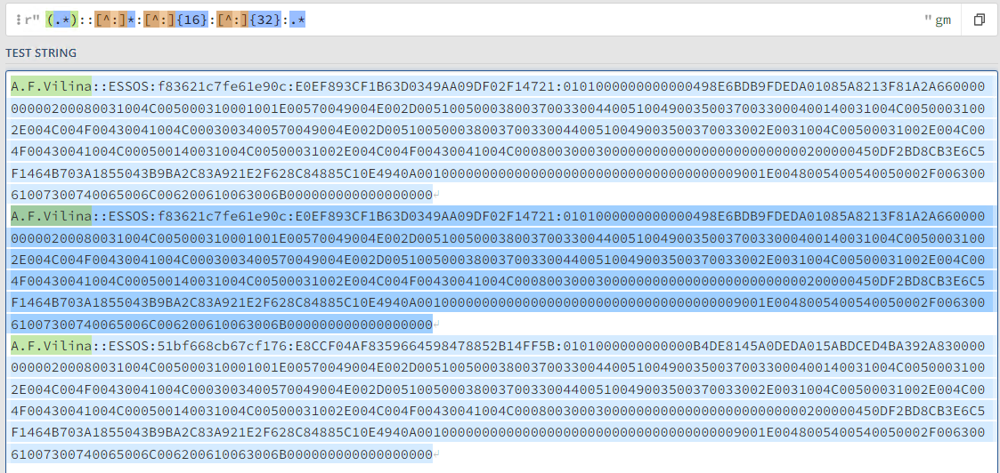
## Формирование запроса
```cypher
MATCH (n) WHERE n.samaccountname =~ "(?i)<user>" SET n.NTLMv2_Count = <count>;
```
Поле user автоматически берется из всех найденных NTLMv2 хэшей
## Customqueries
```json
{
	"name": "All object which NTLMv2 we have",
	"category" : "Extended_bh",
	"queryList": [
		{
			"final": true,
			"query": "MATCH (n) WHERE n.NTLMv2_Count>0 return n;"
		}
	]
}
```
Запрос:
```cypher
MATCH (n) WHERE n.NTLMv2_Count>0 return n;
```
Возвращает все узлы у которых параметр NTLMv2_Count установлен
Пример:

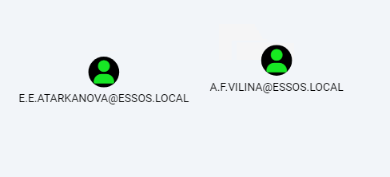
# Brute
## Параметры
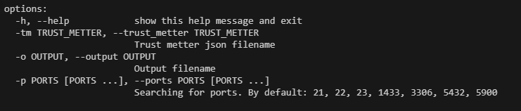

### trust_metter(tm)
Имя `json` файла сгенерированного Trust Metter
Пример файла
```json
{
    "accessible_assets_count": 970,
    "accessible_client_assets_count": 783,
    "accessible_cloud_assets_count": 0,
    "accessible_server_assets_count": 164,
    "accessible_unknown_assets_count": 23,
    "assets": {
        "1-121-22.test-tv.ru": {
            "closed_tcp_ports": "",
            "closed_udp_ports": "",
            "distinguishedName": "cn=1-121-22,ou=w7wokrstations,ou=rus,ou=ostankino site,ou=cce,dc=test-tv,dc=ru",
            "fqdn": "1-121-22.test-tv.ru",
            "ip_address": [
                "172.30.82.40"
            ],
            "name": "1-121-22",
            "os": "Windows 10 \u041a\u043e\u0440\u043f\u043e\u0440\u0430\u0442\u0438\u0432\u043d\u0430\u044f",
            "os_ver": "10.0 (15063)",
            "resolved": true,
            "source": "Active Directory",
            "source_type": "Active Directory",
            "targets": "",
            "tcp_ports": "135, 139, 445, 3389",
            "type": "Client",
            "udp_ports": "",
            "wave": "Directly"
        },
        "1-121-23.test-tv.ru": {
            "closed_tcp_ports": "",
            "closed_udp_ports": "",
            "distinguishedName": "cn=1-121-23,ou=w7wokrstations,ou=rus,ou=ostankino site,ou=cce,dc=test-tv,dc=ru",
            "fqdn": "1-121-23.test-tv.ru",
            "ip_address": [
                "172.30.30.143"
            ],
            "name": "1-121-23",
            "os": "Windows 10 \u041a\u043e\u0440\u043f\u043e\u0440\u0430\u0442\u0438\u0432\u043d\u0430\u044f",
            "os_ver": "10.0 (15063)",
            "resolved": true,
            "source": "Active Directory",
            "source_type": "Active Directory",
            "targets": "",
            "tcp_ports": "135, 139, 445, 3389",
            "type": "Client",
            "udp_ports": "137",
            "wave": "Directly"
        },
        ...
```
### output(o)
Имя файла в который записывается результат
По умолчанию `extended_brute_bh_%d_%m_%H_%M.txt`
Пример:
```cypher
MATCH (c:Computer) WHERE c.name =~ "(?i)8-23-01.ntv-tv.ru.*" SET c.BrutableService = ['21', '23'];
MATCH (c:Computer) WHERE c.name =~ "(?i)agile.ntv-tv.ru.*" SET c.BrutableService = ['21', '1433'];
MATCH (c:Computer) WHERE c.name =~ "(?i)astra05.ntv-tv.ru.*" SET c.BrutableService = ['23', '22'];
MATCH (c:Computer) WHERE c.name =~ "(?i)astra06.ntv-tv.ru.*" SET c.BrutableService = ['23', '22'];
...
```
### ports(p)
Какие порты должны быть открыты для добавления свойства.
Пример использования
```
extender_bh brute -tm <tm>.json -p 21 22 5432 
```
По умолчанию:
- 21 - FTP
- 22- SSH
- 23 - Telnet
- 1433 - MSSQL
- 3306 - MySql
- 5432 - Postgres
- 5900 - VNC
## Запросы
```cypher
MATCH (c:Computer) WHERE c.name =~ "(?i){muz["fqdn"]}.*" SET c.BrutableService = {found_port};
```
Ищет компьютер с соответствующим именем и добавляет к нему найденные открытые порты.
### Компьютеры на которых служба на определенном порте
```cypher
MATCH (n) WHERE {port} in n.BrutableService  return n;
```
### Какие были найдены порты из всего списка
```cypher
MATCH (n) WHERE n.BrutableService IS NOT NULL UNWIND n.BrutableService as User RETURN DISTINCT User
```
## Customquery
### Все компьютеры на которых имеются службы 
```json
{
	"name": "Find brutable service",
	"category": "Extended_bh",
	"queryList": [
		{
			"final": true,
			"query": "MATCH (n) WHERE n.BrutableService  return n;"
		}              
	]
}
```
Запрос:
```cypher
MATCH (n) WHERE n.BrutableService  return n;
```
# Pre2k
## Команда для получения файла с результатами
```
pre2k auth -u <user> -p <passw> -dc-ip <ip> -d <domain> -n -outputfile <filename>
```
## Параметры
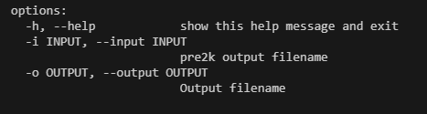
### input(i)
Имя файла с результатом работы pre2k
Пример файла:
```
Invalid credentials: essos.local\WIN-GZXRUEUMLOE$:win-gzxrueumlo
Invalid credentials: essos.local\DESKTOP-P30HULT$:desktop-p30hul
Invalid credentials: essos.local\WIN-GY4TPRPAHJ5$:win-gy4tprpahj
Invalid credentials: essos.local\WIN-NFO1MYAE2XL$:win-nfo1myae2x
Invalid credentials: essos.local\WIN-VHIFESOFDMQ$:win-vhifesofdm
['[green bold]VALID CREDENTIALS[/]', ' essos.local\\test$', 'test']
Invalid credentials: essos.local\Administrator$:administrator
```
### output(o)
Имя файла в который записывается результат
По умолчанию `extended_pre2k_bh_%d_%m_%H_%M.txt`
Пример:
```cypher
MATCH (c:Computer) WHERE c.name =~ "(?i)test.essos.local.*" SET c.ClearTextPassword = "test" SET c.owned = True;
MATCH (c:Computer) WHERE c.name =~ "(?i)test5.essos.local.*" SET c.ClearTextPassword = "" SET c.owned = True;
```
## Регулярные выражения
```regex
VALID CREDENTIALS[^,]*, ' ([^\\]*)\\\\([^']*)', '([^']*)
```
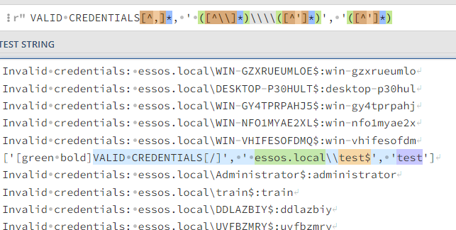
## Формирование запроса
```cypher
MATCH (c:Computer) WHERE c.name =~ "(?i)<user>.<domain>.*" 
SET c.ClearTextPassword = "<password>" SET c.owned = True;
```
## Customquery
### Все компьютеры с пустым паролем
```json
{
	"name": "Find all computers with ClearTextPassword",
	"category" : "Extended_bh",
	"queryList": [
		{
			"final": true,
			"query": "MATCH (c:Computer) WHERE c.ClearTextPassword IS NOT NULL return c;"
		}
	]
}
```
Запрос:
```cypher
MATCH (c:Computer) WHERE c.ClearTextPassword IS NOT NULL return c;
```
# Localadmin
## Формирования файла на вход
Для формирования файла, подаваемого на вход нужно запустить скрипт `localadmin.sh`, который находится в папке `scripts`
```bash
#!/bin/bash
cat $2 | while read line
do
    echo "[+]" $line;
    net rpc group members Administrators -U $1 -I $line;
    echo ;
done
```
Здесь `$1` - параметр с учетными данными в виде `user%pass` 
Здесь `$2` - имя файла с именами или ip адресами целей
## Параметры
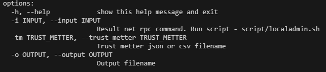
### input(i)
Имя файла с результатом работы localadmin.sh
Пример файла:
```
[+] 10.2.1.71
DEVEL\Domain Admins
DEVEL\Enterprise Admins
DEVEL\devel_da
DEVEL\adaxes_srv

[+] nibiru04.devel.ifx
DEVEL\Domain Admins
DEVEL\Enterprise Admins
DEVEL\devel_da
DEVEL\adaxes_srv
```
### trust_metter(tm)
Имя `json` или `csv` файла сгенерированного Trust Metter. 
Не обязательный параметр, используется для преобразования `ip` в `fqdn`
### output (o)
Имя файла в который записывается результат
По умолчанию `extended_localadmin_bh_%d_%m_%H_%M.txt`
Пример:
```
MATCH (u) WHERE u.name =~ "(?i)Domain Admins@DEVEL.*" MATCH (c: Computer) WHERE c.name =~ "(?i)nibiru04.devel.ifx.*" MERGE (u)-[r: AdminTo]->(c) SET u.LocalAdmin = True;
MATCH (u) WHERE u.name =~ "(?i)Enterprise Admins@DEVEL.*" MATCH (c: Computer) WHERE c.name =~ "(?i)nibiru04.devel.ifx.*" MERGE (u)-[r: AdminTo]->(c) SET u.LocalAdmin = True;
MATCH (u) WHERE u.name =~ "(?i)devel_da@DEVEL.*" MATCH (c: Computer) WHERE c.name =~ "(?i)nibiru04.devel.ifx.*" MERGE (u)-[r: AdminTo]->(c) SET u.LocalAdmin = True;
M
```
## Формирование запроса
```cypher
MATCH (u) WHERE u.name =~ "(?i){username}@{domain}.*" MATCH (c: Computer) WHERE c.name =~ "(?i){target}.*" MERGE (u)-[r: AdminTo]->(c) SET u.LocalAdmin = True;
```
## Customquery
### Все сущности которые имеют связь AdminTo
```json
{
	"name": "List all users which admin to computer",
	"category" : "Extended_bh",
	"queryList": [
		{
			"final": true,
			"query": "MATCH p=(n)-[b:AdminTo]->(c:Computer) RETURN p"
		}
	]
}
```
# Neo4j
## Параметры
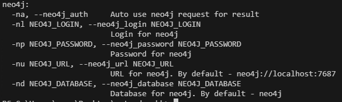
### neo4j_auth (na)
Включает использования neo4j и отправки запросов сразу в базу
### neo4j_login и neo4j_password
Данные для подключения к базе
Обязательные при использовании данного модуля
### neo4j_url
Расположение базы.
По умолчанию : `neo4j://localhost:7687`
### neo4j_database
База данных в которую отправляются запросы
По умолчанию: `neo4j`
## Особенности реализации
Если данные для входа не действительны либо во время добавления запросов возникает ошибка, программа перестает посылать запросы и формирует файл с запросами.

